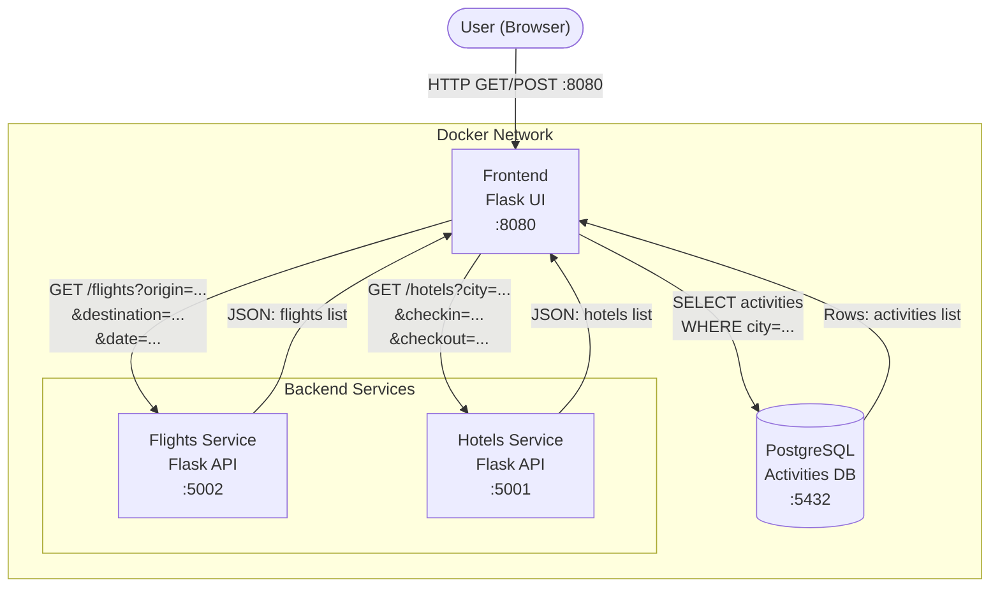

# Phase 1: Goals and Reminders

## Architecture Overview

Phase 1 covers a microservices application utilizing Flask, PostgreSQL, and OpenTelemetry without AI components.



| Service    | Port  | Description                              |
|------------|-------|------------------------------------------|
| frontend   | 8080  | Flask UI — search form + results page    |
| flights    | 5002  | Generates flight options                 |
| hotels     | 5001  | Generates hotel options                  |
| postgres   | 5432  | Stores activities seeded from init.sql   |

## Prerequisites

- Docker >= 24.x
- Docker Compose >= 2.x
- `curl` (for testing)
- `git` (to clone the repo)

Verify the operational setup:
```bash
docker --version
docker compose version
```

## Dependencies

### Python packages (shared/requirements.txt)

| Package | Purpose |
|---------|---------|
| `flask` | Web framework |
| `requests` | HTTP calls between services |
| `psycopg2-binary` | PostgreSQL client |
| `opentelemetry-sdk` | OTel SDK |
| `opentelemetry-exporter-otlp-proto-grpc` | OTel OTLP exporter |
| `opentelemetry-instrumentation-flask` | Auto Flask tracing |

## OpenTelemetry

The application is instrumented with OpenTelemetry for traces, metrics, and logs. It attempts to export telemetry data to `http://otel-collector:4317`. If no collector is running, the services drop the telemetry data but continue to operate normally.

To implement a collector, append the following to `docker-compose.yaml`:
```yaml
otel-collector:
  image: otel/opentelemetry-collector-contrib:latest
  volumes:
    - ./otel-config.yaml:/etc/otelcol-contrib/config.yaml
  ports:
    - "4317:4317"
```
