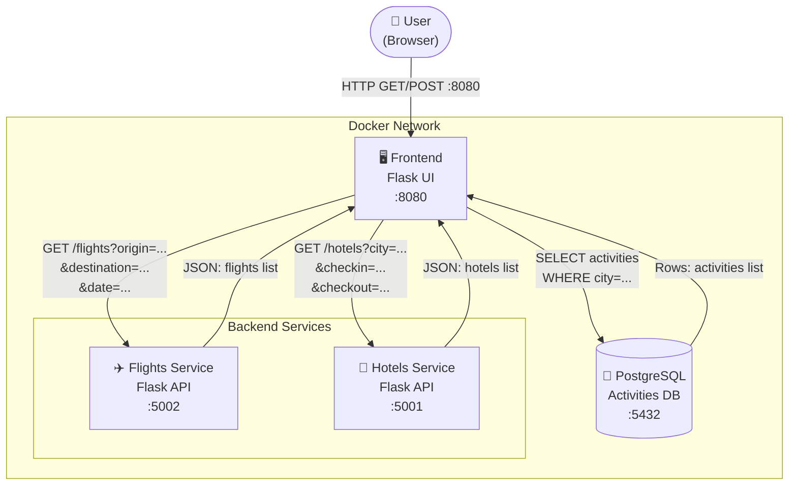

# 🧳 Demo Travel App — Lab Guide

A microservices-based travel agency app built with Flask, PostgreSQL, and OpenTelemetry. This guide walks you through deploying the app from scratch and running functional tests.

---

## 📐 Architecture Overview



| Service    | Port  | Description                              |
|------------|-------|------------------------------------------|
| frontend   | 8080  | Flask UI — search form + results page    |
| flights    | 5002  | Generates flight options on the fly      |
| hotels     | 5001  | Generates hotel options on the fly       |
| postgres   | 5432  | Stores activities seeded from init.sql   |

---

## 🛠️ Prerequisites

- Docker >= 24.x
- Docker Compose >= 2.x
- `curl` (for testing)
- `git` (to clone the repo)

Verify your setup:

```bash
docker --version
docker compose version
```

---

## 🚀 Deployment

### 1. Clone the repository

```bash
git clone <your-repo-url> demo_travel
cd demo_travel
```

### 2. Review the project structure

```
demo_travel/
├── docker-compose.yaml
├── postgres/
│   └── init.sql            # DB schema + seed data (auto-runs on first start)
├── shared/
│   ├── logging.py          # OTel logging setup
│   ├── metrics.py          # OTel metrics setup
│   ├── tracing.py          # OTel tracing setup
│   └── requirements.txt    # Shared Python dependencies
├── flights/
│   ├── Dockerfile
│   └── app.py
├── hotels/
│   ├── Dockerfile
│   └── app.py
└── frontend/
    ├── Dockerfile
    ├── app.py
    ├── init_activities.py
    └── templates/
        └── index.html
```

### 3. Build and start all services

```bash
docker compose -f docker-compose-tools.yaml up -d --build
docker compose up --build -d
```

> **Note:** The `--build` flag forces Docker to rebuild images. Use it whenever you change application code.

### 4. Verify all containers are running

```bash
docker ps
```

Expected output — all 4 services should show `Up`:

```
CONTAINER ID   IMAGE                  STATUS          PORTS
xxxxxxxxxxxx   demo_travel-frontend   Up X seconds    0.0.0.0:8080->5000/tcp
xxxxxxxxxxxx   demo_travel-hotels     Up X seconds    0.0.0.0:5001->5001/tcp
xxxxxxxxxxxx   demo_travel-flights    Up X seconds    0.0.0.0:5002->5002/tcp
xxxxxxxxxxxx   postgres:15            Up X seconds    0.0.0.0:5432->5432/tcp
```

### 5. Open the app

Navigate to [http://localhost:8080](http://localhost:8080) in your browser.

---

## 🧪 Testing

### Health checks

Verify each service is alive:

```bash
curl http://localhost:8080/health
curl http://localhost:5001/health
curl http://localhost:5002/health
```

All should return:

```json
{"status": "ok"}
```

---

### Test the Flights service

Query flights directly with parameters:

```bash
curl "http://localhost:5002/flights?origin=Paris&destination=Barcelona&date=2025-06-15"
```

Expected: a JSON array of 3–6 flight objects, each containing:

```json
[
  {
    "airline": "SkyJet",
    "origin": "Paris",
    "destination": "Barcelona",
    "date": "2025-06-15",
    "departure_time": "08:00",
    "arrival_time": "09:30",
    "duration_hours": 1.5,
    "stops": 0,
    "price": 134
  }
]
```

Run it multiple times — results should differ each call (generated on the fly).

---

### Test the Hotels service

```bash
curl "http://localhost:5001/hotels?city=Barcelona&checkin=2025-06-15&checkout=2025-06-20"
```

Expected: a JSON array of 3–5 hotel objects:

```json
[
  {
    "name": "Grand Palace Barcelona",
    "city": "Barcelona",
    "stars": 4,
    "price_per_night": 120,
    "total_price": 600,
    "nights": 5,
    "amenities": ["WiFi", "Pool", "Gym"],
    "rating": 8.7
  }
]
```

Note that `total_price` should equal `price_per_night × nights`.

---

### Test the PostgreSQL activities

Connect directly to the database and inspect the seeded data:

```bash
docker exec demo_travel-postgres-1 psql -U travel -d travel -c "SELECT * FROM activities;"
```

Expected output — 10 rows with a `city` column:

```
 id |         title          |               description                |    city
----+------------------------+------------------------------------------+-----------
  1 | Sagrada Familia        | Gaudí's unfinished masterpiece           | Barcelona
  2 | Park Güell             | Mosaic terraces with city views          | Barcelona
  ...
 10 | Cooking Class          | Learn to cook traditional local dishes   |
```

---

### End-to-end test via the UI

1. Open [http://localhost:8080](http://localhost:8080)
2. Fill in the search form:
   - **From:** Paris
   - **To:** Barcelona
   - **Departure date:** any future date
   - **Return date:** a few days after departure
3. Click **Search trips**
4. Verify the results page shows three sections: Flights, Hotels, and Activities

---

### End-to-end test via curl (POST)

```bash
curl -s -X POST http://localhost:8080/ \
  -d "origin=Paris&destination=Barcelona&departure_date=2025-06-15&return_date=2025-06-20" \
  | grep -o "<h3>[^<]*</h3>"
```

You should see hotel names, airline names, and activity titles in the output.

---

## 🔄 Common Operations

### View logs

```bash
# All services at once
docker compose logs -f

# Single service
docker logs demo_travel-frontend-1 --tail 50 -f
docker logs demo_travel-flights-1 --tail 50 -f
docker logs demo_travel-hotels-1 --tail 50 -f
```

### Restart a single service

```bash
docker compose restart frontend
```

### Rebuild after a code change

```bash
docker compose up --build -d
```

### Full reset (destroys DB data)

```bash
docker compose down -v
docker compose up --build -d
```

> ⚠️ The `-v` flag removes the `postgres_data` volume. The database will be re-seeded automatically from `postgres/init.sql` on next start.

### Add activities for a new city

```bash
docker exec demo_travel-postgres-1 psql -U travel -d travel << 'EOF'
INSERT INTO activities (title, description, city) VALUES
    ('Eiffel Tower', 'Visit the symbol of Paris', 'Paris'),
    ('Louvre Museum', 'Home of the Mona Lisa', 'Paris'),
    ('Seine River Cruise', 'See Paris from the water', 'Paris');
EOF
```

---

## 🐛 Troubleshooting

| Symptom | Likely cause | Fix |
|---------|-------------|-----|
| Container exits with code 1 | Import error in Python | `docker logs <container_id>` to see traceback |
| `500 Internal Server Error` on frontend | DB not ready or missing table | `docker compose down -v && docker compose up -d` |
| `No activities found for <city>` | City not in DB | Insert rows for that city (see above) |
| `ModuleNotFoundError: No module named 'shared'` | Dockerfile missing `COPY shared/ shared/` | Fix Dockerfile, then `docker compose up --build -d` |
| Flights/hotels return empty | Services not reachable from frontend | Check all containers are `Up` with `docker ps` |
| Old DB schema after code change | Volume not wiped | `docker compose down -v` before rebuilding |

---

## 📦 Dependencies

### Python packages (shared/requirements.txt)

| Package | Purpose |
|---------|---------|
| `flask` | Web framework |
| `requests` | HTTP calls between services |
| `psycopg2-binary` | PostgreSQL client |
| `opentelemetry-sdk` | OTel SDK |
| `opentelemetry-exporter-otlp-proto-grpc` | OTel OTLP exporter |
| `opentelemetry-instrumentation-flask` | Auto Flask tracing |

---

## 🔭 OpenTelemetry

The app is instrumented with OpenTelemetry for traces, metrics, and logs. By default it tries to export to `http://otel-collector:4317`. If no collector is running, the services still start normally — telemetry is silently dropped.

To add a collector, add this to `docker-compose.yaml`:

```yaml
otel-collector:
  image: otel/opentelemetry-collector-contrib:latest
  volumes:
    - ./otel-config.yaml:/etc/otelcol-contrib/config.yaml
  ports:
    - "4317:4317"
```
